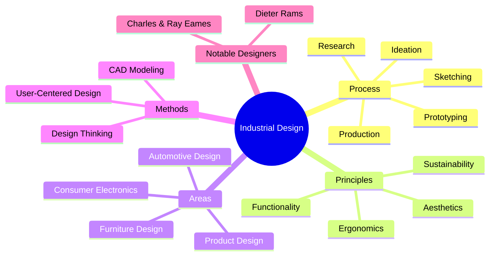

```mermaid
mindmap
  root((Industrial Design))
    Process
      Research
      Ideation
      Sketching
      Prototyping
      Production
    Principles
      Functionality
      Aesthetics
      Ergonomics
      Sustainability
    Areas
      Product Design
      Furniture Design
      Automotive Design
      Consumer Electronics
    Methods
      User-Centered Design
      Design Thinking
      CAD Modeling
    Notable Designers
      Dieter Rams
      Charles & Ray Eames
```

