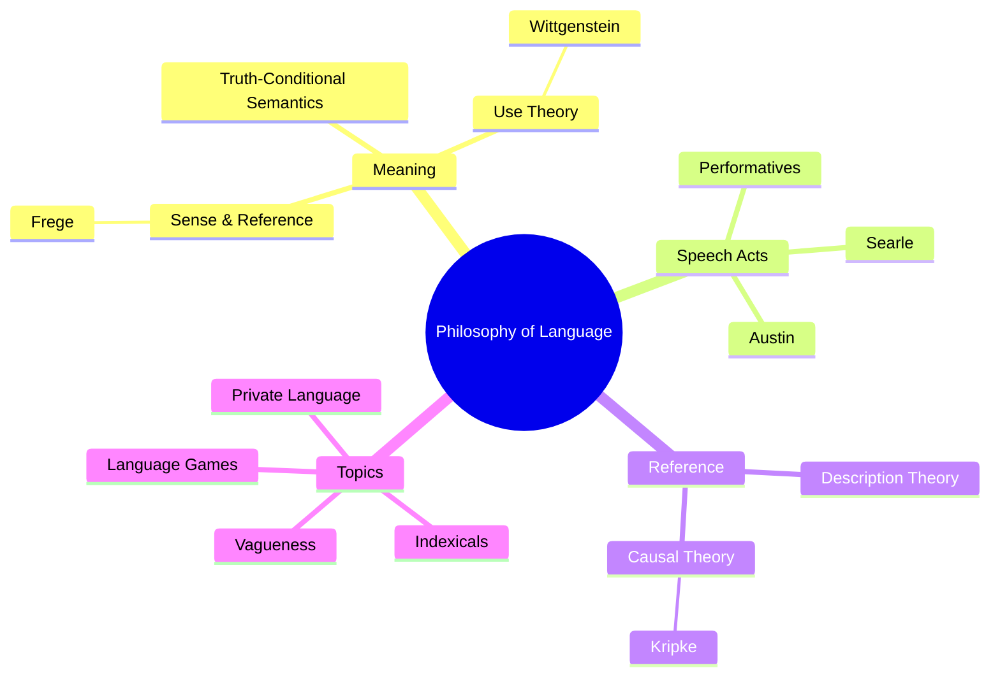

```mermaid
mindmap
  root((Philosophy of Language))
    Meaning
      Sense & Reference
        Frege
      Use Theory
        Wittgenstein
      Truth-Conditional Semantics
    Speech Acts
      Austin
      Searle
      Performatives
    Reference
      Description Theory
      Causal Theory
        Kripke
    Topics
      Private Language
      Language Games
      Indexicals
      Vagueness
```

