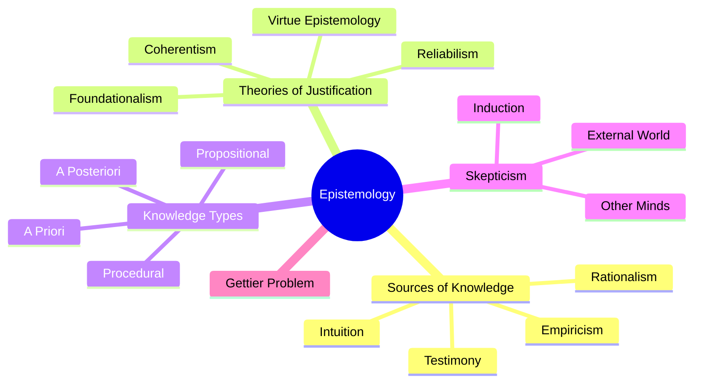

```mermaid
mindmap
  root((Epistemology))
    Sources of Knowledge
      Rationalism
      Empiricism
      Intuition
      Testimony
    Theories of Justification
      Foundationalism
      Coherentism
      Reliabilism
      Virtue Epistemology
    Knowledge Types
      A Priori
      A Posteriori
      Propositional
      Procedural
    Skepticism
      External World
      Other Minds
      Induction
    Gettier Problem
```

