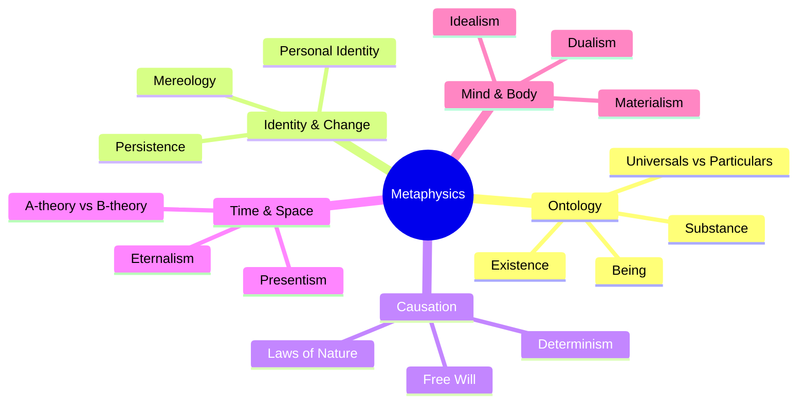

```mermaid
mindmap
  root((Metaphysics))
    Ontology
      Being
      Existence
      Substance
      Universals vs Particulars
    Identity & Change
      Persistence
      Personal Identity
      Mereology
    Causation
      Determinism
      Free Will
      Laws of Nature
    Time & Space
      A-theory vs B-theory
      Presentism
      Eternalism
    Mind & Body
      Dualism
      Materialism
      Idealism
```

