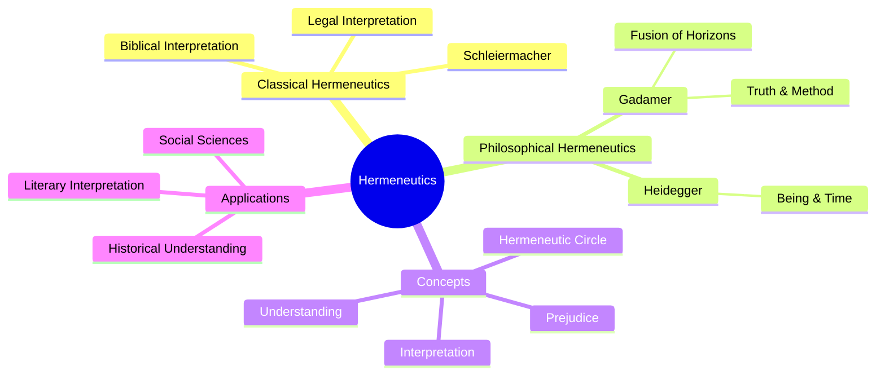

```mermaid
mindmap
  root((Hermeneutics))
    Classical Hermeneutics
      Biblical Interpretation
      Legal Interpretation
      Schleiermacher
    Philosophical Hermeneutics
      Heidegger
        Being & Time
      Gadamer
        Truth & Method
        Fusion of Horizons
    Concepts
      Understanding
      Interpretation
      Hermeneutic Circle
      Prejudice
    Applications
      Literary Interpretation
      Historical Understanding
      Social Sciences
```

