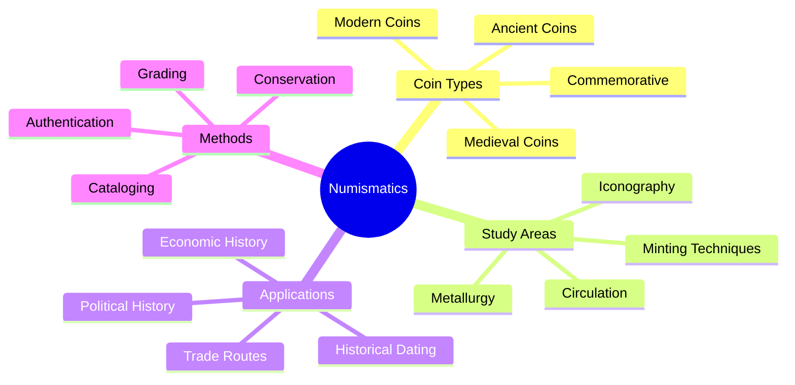

```mermaid
mindmap
  root((Numismatics))
    Coin Types
      Ancient Coins
      Medieval Coins
      Modern Coins
      Commemorative
    Study Areas
      Iconography
      Metallurgy
      Minting Techniques
      Circulation
    Applications
      Historical Dating
      Economic History
      Political History
      Trade Routes
    Methods
      Authentication
      Grading
      Cataloging
      Conservation
```

