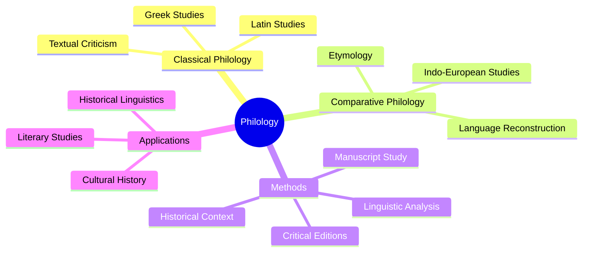

```mermaid
mindmap
  root((Philology))
    Classical Philology
      Greek Studies
      Latin Studies
      Textual Criticism
    Comparative Philology
      Indo-European Studies
      Language Reconstruction
      Etymology
    Methods
      Manuscript Study
      Critical Editions
      Linguistic Analysis
      Historical Context
    Applications
      Literary Studies
      Historical Linguistics
      Cultural History
```

