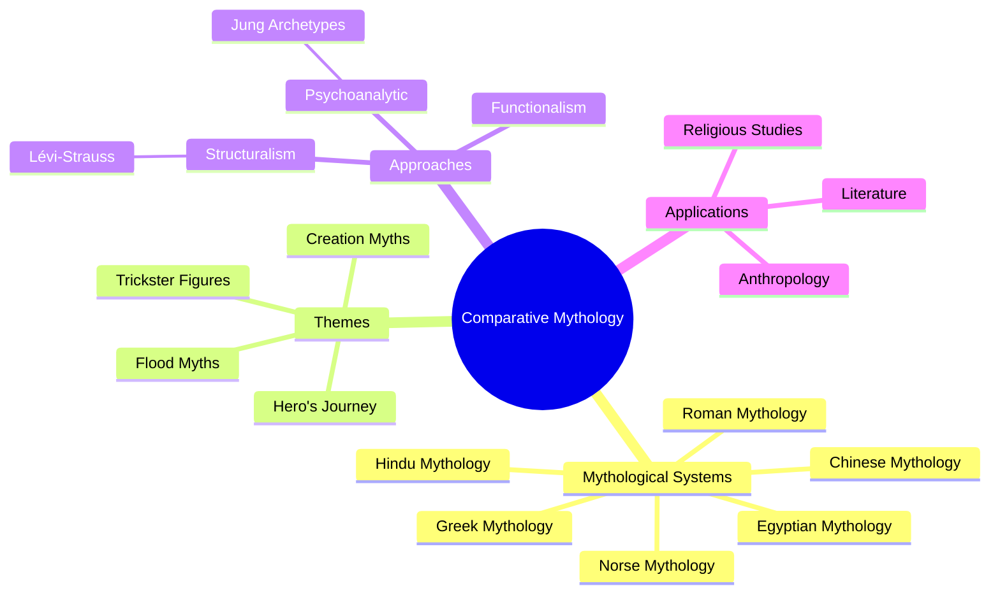

```mermaid
mindmap
  root((Comparative Mythology))
    Mythological Systems
      Greek Mythology
      Roman Mythology
      Norse Mythology
      Egyptian Mythology
      Hindu Mythology
      Chinese Mythology
    Themes
      Creation Myths
      Hero's Journey
      Flood Myths
      Trickster Figures
    Approaches
      Structuralism
        Lévi-Strauss
      Psychoanalytic
        Jung Archetypes
      Functionalism
    Applications
      Literature
      Anthropology
      Religious Studies
```

