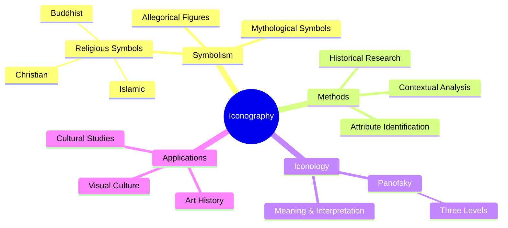

```mermaid
mindmap
  root((Iconography))
    Symbolism
      Religious Symbols
        Christian
        Buddhist
        Islamic
      Mythological Symbols
      Allegorical Figures
    Methods
      Attribute Identification
      Contextual Analysis
      Historical Research
    Iconology
      Panofsky
        Three Levels
      Meaning & Interpretation
    Applications
      Art History
      Visual Culture
      Cultural Studies
```

