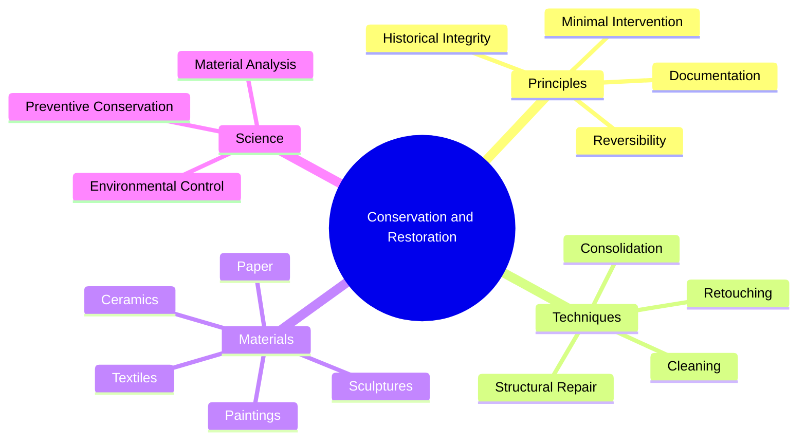

```mermaid
mindmap
  root((Conservation and Restoration))
    Principles
      Reversibility
      Minimal Intervention
      Documentation
      Historical Integrity
    Techniques
      Cleaning
      Consolidation
      Retouching
      Structural Repair
    Materials
      Paintings
      Sculptures
      Textiles
      Paper
      Ceramics
    Science
      Material Analysis
      Environmental Control
      Preventive Conservation
```

