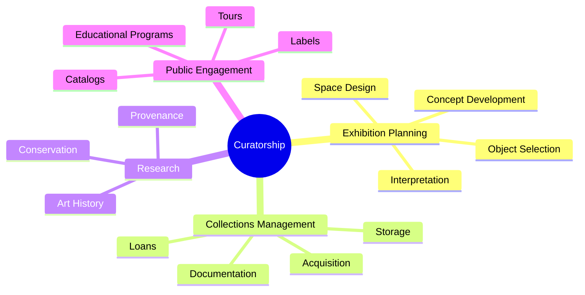

```mermaid
mindmap
  root((Curatorship))
    Exhibition Planning
      Concept Development
      Object Selection
      Space Design
      Interpretation
    Collections Management
      Acquisition
      Documentation
      Storage
      Loans
    Research
      Art History
      Provenance
      Conservation
    Public Engagement
      Educational Programs
      Catalogs
      Labels
      Tours
```

