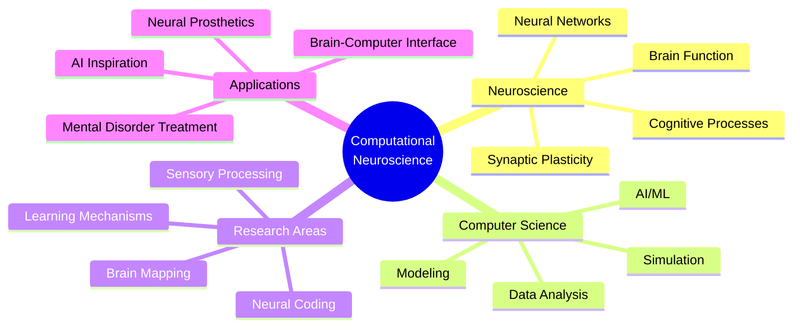

```mermaid
mindmap
  root((Computational<br/>Neuroscience))
    Neuroscience
      Neural Networks
      Brain Function
      Synaptic Plasticity
      Cognitive Processes
    Computer Science
      Modeling
      Simulation
      AI/ML
      Data Analysis
    Research Areas
      Brain Mapping
      Neural Coding
      Learning Mechanisms
      Sensory Processing
    Applications
      Brain-Computer Interface
      Neural Prosthetics
      Mental Disorder Treatment
      AI Inspiration
```

