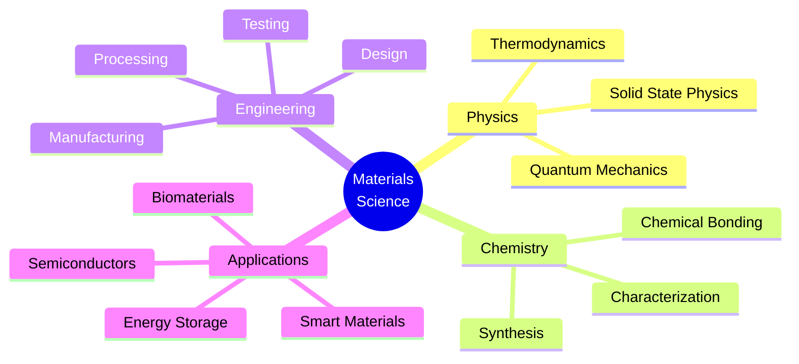

```mermaid
mindmap
  root((Materials<br/>Science))
    Physics
      Quantum Mechanics
      Thermodynamics
      Solid State Physics
    Chemistry
      Chemical Bonding
      Synthesis
      Characterization
    Engineering
      Processing
      Design
      Manufacturing
      Testing
    Applications
      Semiconductors
      Biomaterials
      Smart Materials
      Energy Storage
```

