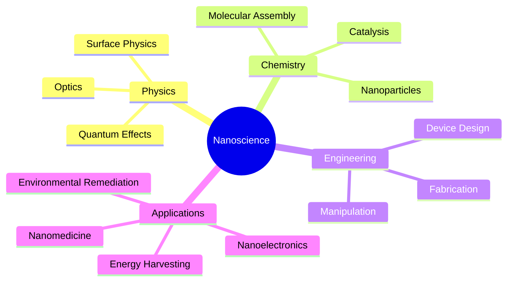

```mermaid
mindmap
  root((Nanoscience))
    Physics
      Quantum Effects
      Surface Physics
      Optics
    Chemistry
      Molecular Assembly
      Catalysis
      Nanoparticles
    Engineering
      Fabrication
      Manipulation
      Device Design
    Applications
      Nanoelectronics
      Nanomedicine
      Energy Harvesting
      Environmental Remediation
```

