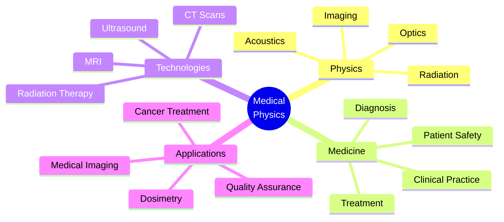

```mermaid
mindmap
  root((Medical<br/>Physics))
    Physics
      Radiation
      Imaging
      Optics
      Acoustics
    Medicine
      Diagnosis
      Treatment
      Patient Safety
      Clinical Practice
    Technologies
      MRI
      CT Scans
      Radiation Therapy
      Ultrasound
    Applications
      Cancer Treatment
      Medical Imaging
      Dosimetry
      Quality Assurance
```

