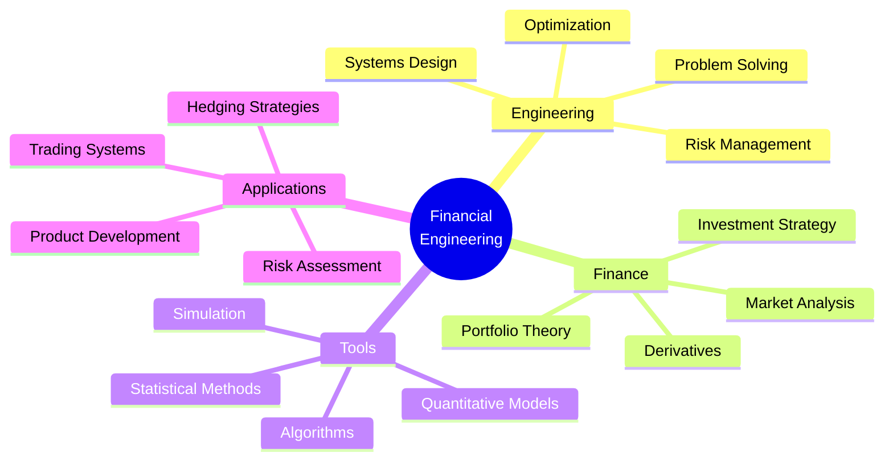

```mermaid
mindmap
  root((Financial<br/>Engineering))
    Engineering
      Systems Design
      Optimization
      Risk Management
      Problem Solving
    Finance
      Derivatives
      Portfolio Theory
      Market Analysis
      Investment Strategy
    Tools
      Quantitative Models
      Algorithms
      Statistical Methods
      Simulation
    Applications
      Trading Systems
      Risk Assessment
      Product Development
      Hedging Strategies
```

