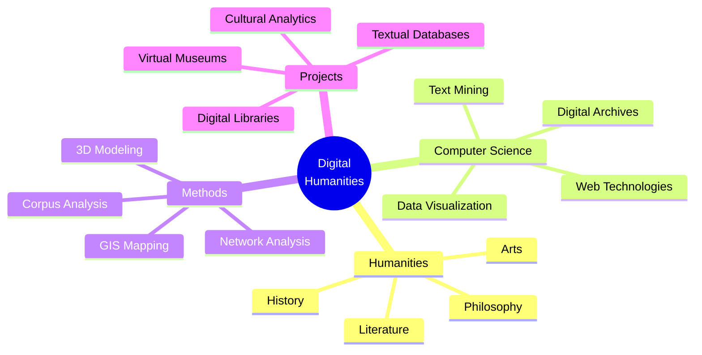

```mermaid
mindmap
  root((Digital<br/>Humanities))
    Humanities
      History
      Literature
      Philosophy
      Arts
    Computer Science
      Data Visualization
      Text Mining
      Digital Archives
      Web Technologies
    Methods
      Corpus Analysis
      Network Analysis
      GIS Mapping
      3D Modeling
    Projects
      Digital Libraries
      Virtual Museums
      Textual Databases
      Cultural Analytics
```

