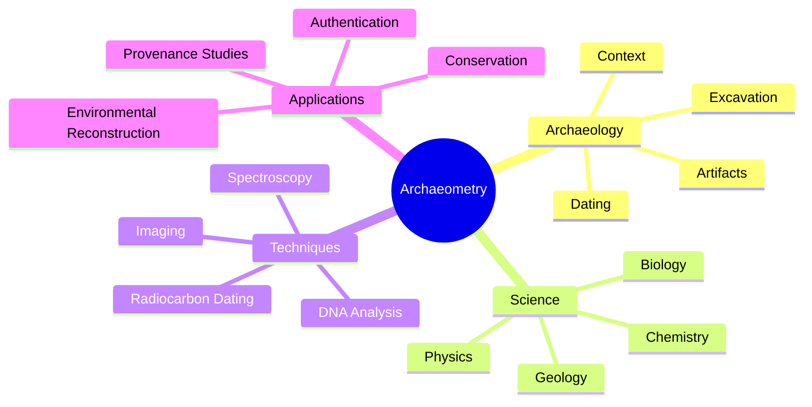

```mermaid
mindmap
  root((Archaeometry))
    Archaeology
      Excavation
      Artifacts
      Dating
      Context
    Science
      Chemistry
      Physics
      Geology
      Biology
    Techniques
      Radiocarbon Dating
      DNA Analysis
      Spectroscopy
      Imaging
    Applications
      Provenance Studies
      Conservation
      Authentication
      Environmental Reconstruction
```

