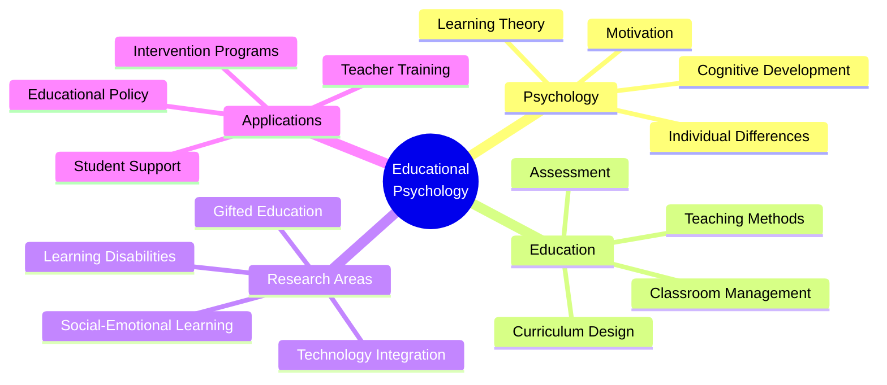

```mermaid
mindmap
  root((Educational<br/>Psychology))
    Psychology
      Learning Theory
      Cognitive Development
      Motivation
      Individual Differences
    Education
      Teaching Methods
      Curriculum Design
      Assessment
      Classroom Management
    Research Areas
      Learning Disabilities
      Gifted Education
      Social-Emotional Learning
      Technology Integration
    Applications
      Student Support
      Teacher Training
      Educational Policy
      Intervention Programs
```

