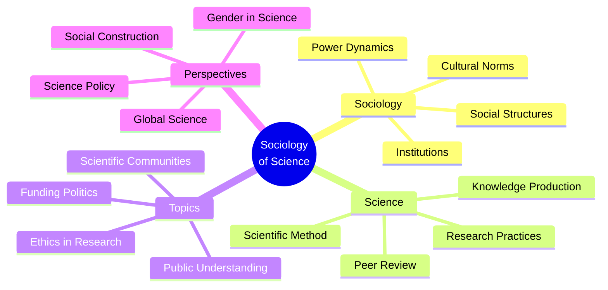

```mermaid
mindmap
  root((Sociology<br/>of Science))
    Sociology
      Social Structures
      Institutions
      Power Dynamics
      Cultural Norms
    Science
      Research Practices
      Scientific Method
      Knowledge Production
      Peer Review
    Topics
      Scientific Communities
      Funding Politics
      Public Understanding
      Ethics in Research
    Perspectives
      Social Construction
      Science Policy
      Gender in Science
      Global Science
```

