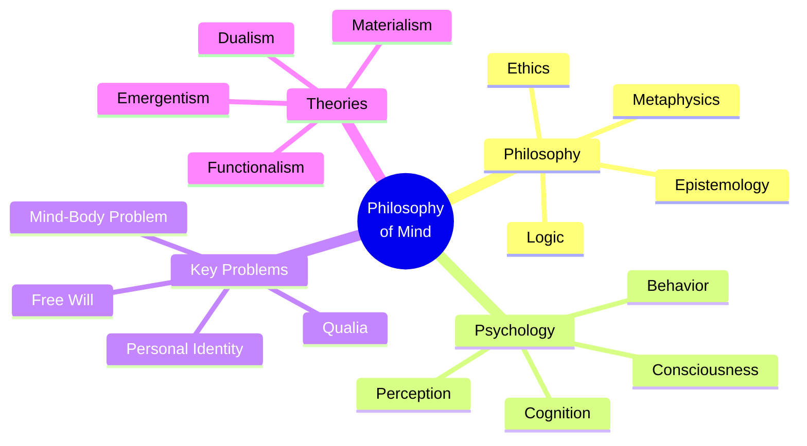

```mermaid
mindmap
  root((Philosophy<br/>of Mind))
    Philosophy
      Metaphysics
      Epistemology
      Logic
      Ethics
    Psychology
      Consciousness
      Perception
      Cognition
      Behavior
    Key Problems
      Mind-Body Problem
      Free Will
      Personal Identity
      Qualia
    Theories
      Dualism
      Functionalism
      Materialism
      Emergentism
```

