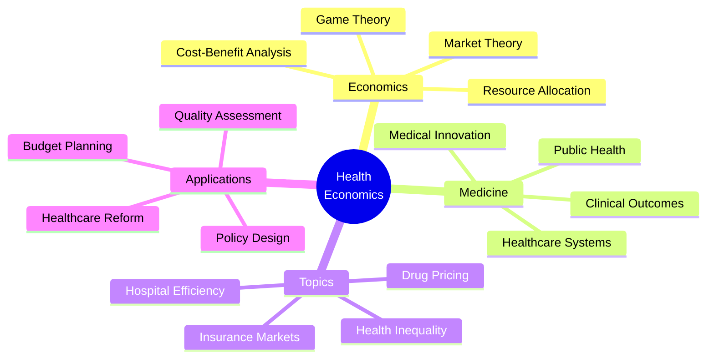

```mermaid
mindmap
  root((Health<br/>Economics))
    Economics
      Cost-Benefit Analysis
      Market Theory
      Resource Allocation
      Game Theory
    Medicine
      Healthcare Systems
      Clinical Outcomes
      Public Health
      Medical Innovation
    Topics
      Insurance Markets
      Drug Pricing
      Hospital Efficiency
      Health Inequality
    Applications
      Policy Design
      Healthcare Reform
      Budget Planning
      Quality Assessment
```

