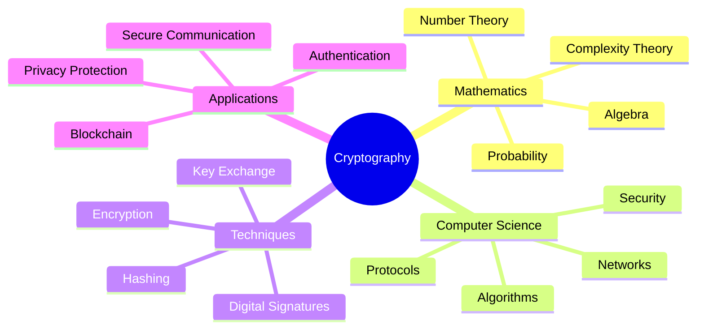

```mermaid
mindmap
  root((Cryptography))
    Mathematics
      Number Theory
      Algebra
      Probability
      Complexity Theory
    Computer Science
      Algorithms
      Security
      Networks
      Protocols
    Techniques
      Encryption
      Hashing
      Digital Signatures
      Key Exchange
    Applications
      Secure Communication
      Blockchain
      Authentication
      Privacy Protection
```

