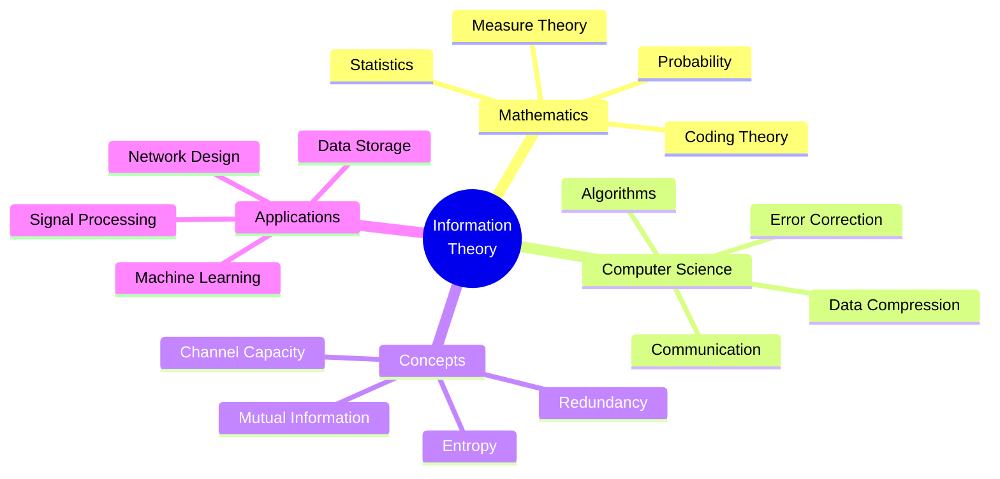

```mermaid
mindmap
  root((Information<br/>Theory))
    Mathematics
      Probability
      Statistics
      Coding Theory
      Measure Theory
    Computer Science
      Data Compression
      Error Correction
      Communication
      Algorithms
    Concepts
      Entropy
      Mutual Information
      Channel Capacity
      Redundancy
    Applications
      Data Storage
      Network Design
      Machine Learning
      Signal Processing
```

