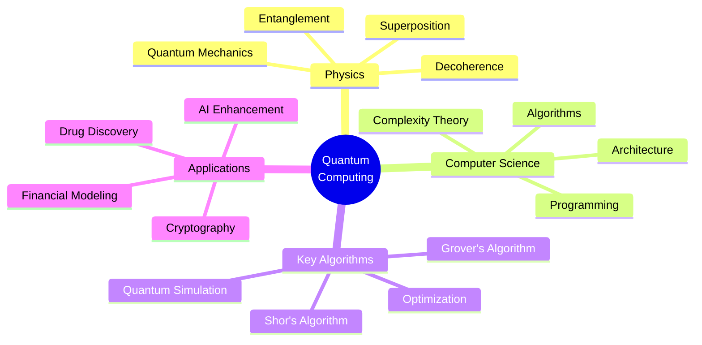

```mermaid
mindmap
  root((Quantum<br/>Computing))
    Physics
      Quantum Mechanics
      Superposition
      Entanglement
      Decoherence
    Computer Science
      Algorithms
      Complexity Theory
      Programming
      Architecture
    Key Algorithms
      Shor's Algorithm
      Grover's Algorithm
      Quantum Simulation
      Optimization
    Applications
      Cryptography
      Drug Discovery
      Financial Modeling
      AI Enhancement
```

