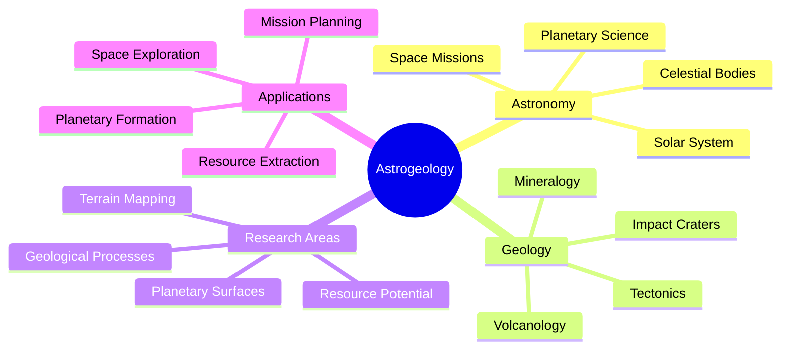

```mermaid
mindmap
  root((Astrogeology))
    Astronomy
      Planetary Science
      Solar System
      Celestial Bodies
      Space Missions
    Geology
      Mineralogy
      Tectonics
      Volcanology
      Impact Craters
    Research Areas
      Planetary Surfaces
      Geological Processes
      Resource Potential
      Terrain Mapping
    Applications
      Mission Planning
      Space Exploration
      Resource Extraction
      Planetary Formation
```

