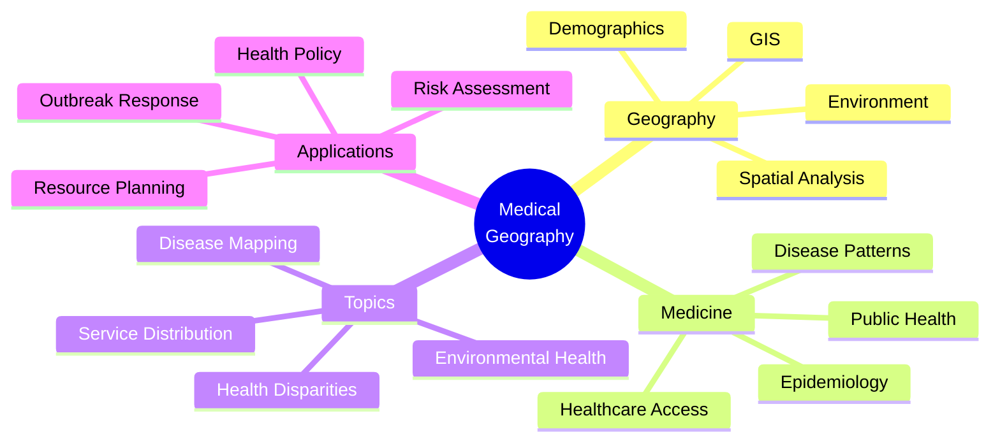

```mermaid
mindmap
  root((Medical<br/>Geography))
    Geography
      Spatial Analysis
      GIS
      Environment
      Demographics
    Medicine
      Epidemiology
      Public Health
      Disease Patterns
      Healthcare Access
    Topics
      Disease Mapping
      Health Disparities
      Environmental Health
      Service Distribution
    Applications
      Outbreak Response
      Resource Planning
      Health Policy
      Risk Assessment
```

