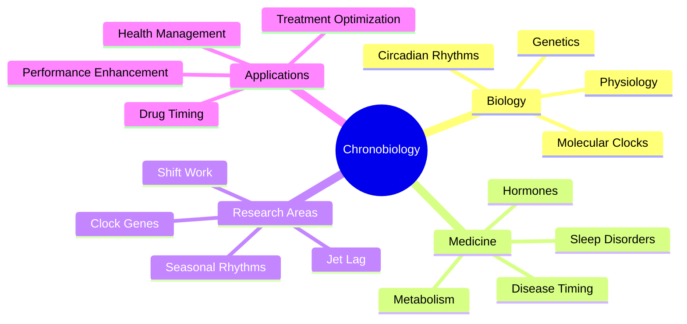

```mermaid
mindmap
  root((Chronobiology))
    Biology
      Circadian Rhythms
      Molecular Clocks
      Genetics
      Physiology
    Medicine
      Sleep Disorders
      Metabolism
      Hormones
      Disease Timing
    Research Areas
      Clock Genes
      Seasonal Rhythms
      Jet Lag
      Shift Work
    Applications
      Drug Timing
      Treatment Optimization
      Performance Enhancement
      Health Management
```

