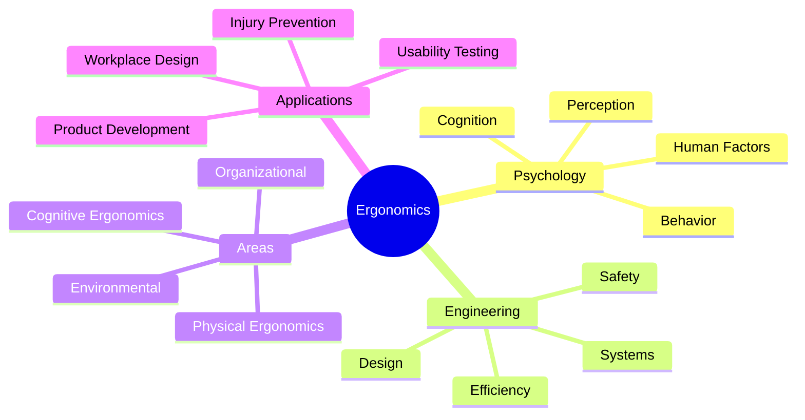

```mermaid
mindmap
  root((Ergonomics))
    Psychology
      Cognition
      Perception
      Human Factors
      Behavior
    Engineering
      Design
      Systems
      Safety
      Efficiency
    Areas
      Physical Ergonomics
      Cognitive Ergonomics
      Organizational
      Environmental
    Applications
      Workplace Design
      Product Development
      Injury Prevention
      Usability Testing
```

