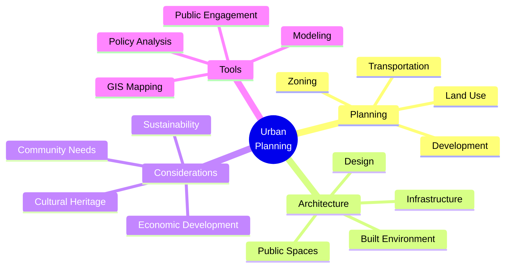

```mermaid
mindmap
  root((Urban<br/>Planning))
    Planning
      Land Use
      Transportation
      Zoning
      Development
    Architecture
      Design
      Built Environment
      Public Spaces
      Infrastructure
    Considerations
      Sustainability
      Community Needs
      Economic Development
      Cultural Heritage
    Tools
      GIS Mapping
      Modeling
      Public Engagement
      Policy Analysis
```

