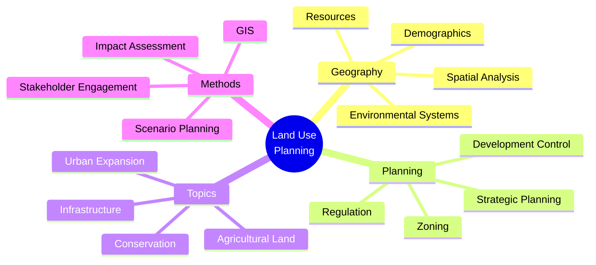

```mermaid
mindmap
  root((Land Use<br/>Planning))
    Geography
      Spatial Analysis
      Environmental Systems
      Demographics
      Resources
    Planning
      Zoning
      Regulation
      Development Control
      Strategic Planning
    Topics
      Agricultural Land
      Urban Expansion
      Conservation
      Infrastructure
    Methods
      GIS
      Impact Assessment
      Stakeholder Engagement
      Scenario Planning
```

