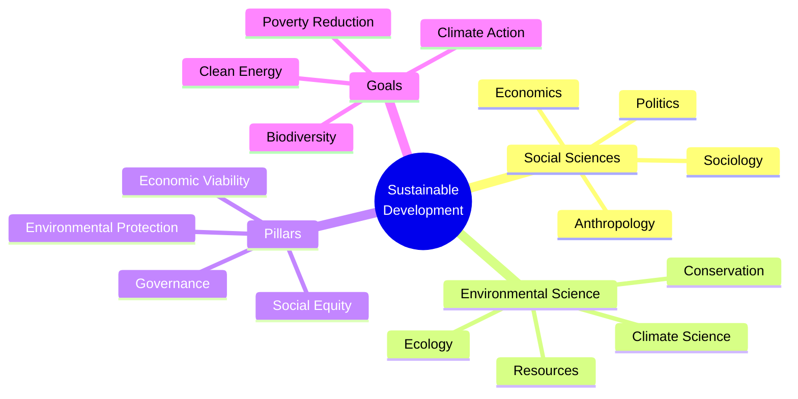

```mermaid
mindmap
  root((Sustainable<br/>Development))
    Social Sciences
      Economics
      Sociology
      Politics
      Anthropology
    Environmental Science
      Ecology
      Climate Science
      Resources
      Conservation
    Pillars
      Economic Viability
      Social Equity
      Environmental Protection
      Governance
    Goals
      Poverty Reduction
      Clean Energy
      Climate Action
      Biodiversity
```

