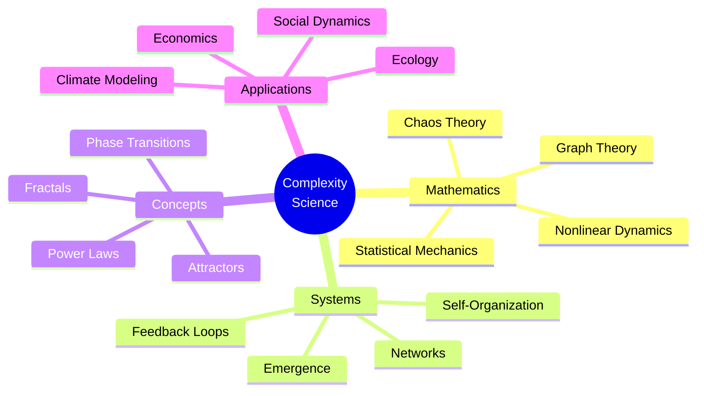

```mermaid
mindmap
  root((Complexity<br/>Science))
    Mathematics
      Nonlinear Dynamics
      Chaos Theory
      Graph Theory
      Statistical Mechanics
    Systems
      Emergence
      Self-Organization
      Networks
      Feedback Loops
    Concepts
      Fractals
      Power Laws
      Phase Transitions
      Attractors
    Applications
      Economics
      Ecology
      Social Dynamics
      Climate Modeling
```

