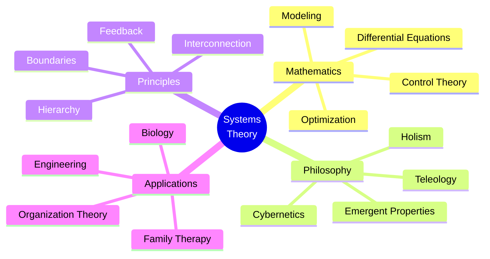

```mermaid
mindmap
  root((Systems<br/>Theory))
    Mathematics
      Modeling
      Differential Equations
      Control Theory
      Optimization
    Philosophy
      Holism
      Emergent Properties
      Cybernetics
      Teleology
    Principles
      Feedback
      Hierarchy
      Boundaries
      Interconnection
    Applications
      Engineering
      Biology
      Organization Theory
      Family Therapy
```

