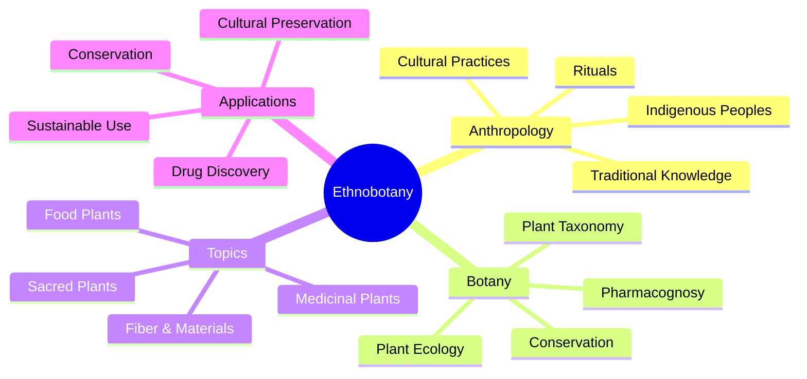

```mermaid
mindmap
  root((Ethnobotany))
    Anthropology
      Traditional Knowledge
      Cultural Practices
      Indigenous Peoples
      Rituals
    Botany
      Plant Taxonomy
      Plant Ecology
      Pharmacognosy
      Conservation
    Topics
      Medicinal Plants
      Food Plants
      Sacred Plants
      Fiber & Materials
    Applications
      Drug Discovery
      Conservation
      Sustainable Use
      Cultural Preservation
```

