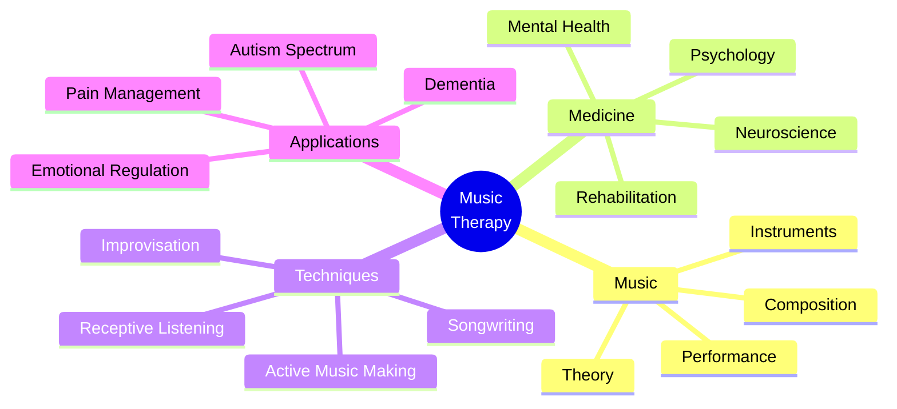

```mermaid
mindmap
  root((Music<br/>Therapy))
    Music
      Performance
      Composition
      Theory
      Instruments
    Medicine
      Psychology
      Neuroscience
      Rehabilitation
      Mental Health
    Techniques
      Active Music Making
      Receptive Listening
      Improvisation
      Songwriting
    Applications
      Autism Spectrum
      Dementia
      Pain Management
      Emotional Regulation
```

