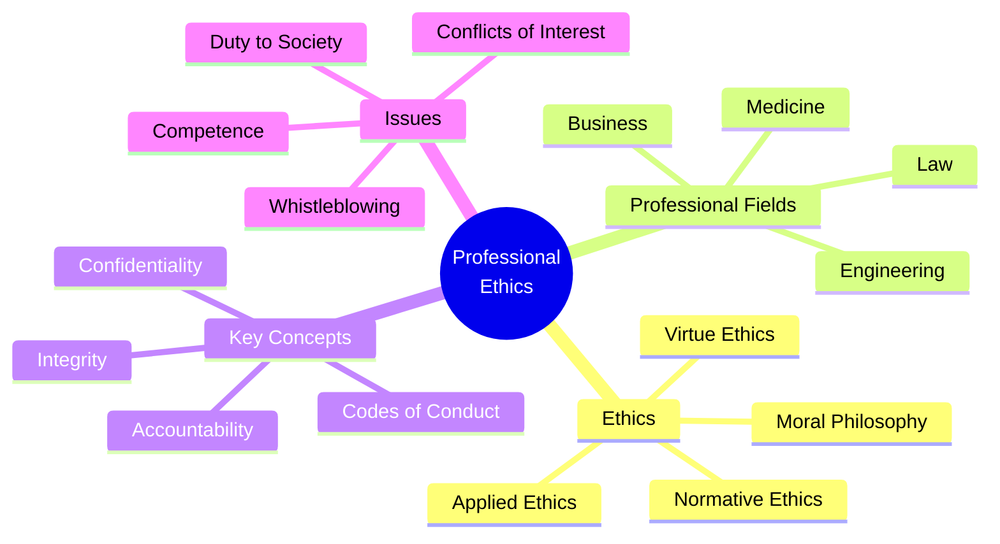

```mermaid
mindmap
  root((Professional<br/>Ethics))
    Ethics
      Moral Philosophy
      Normative Ethics
      Applied Ethics
      Virtue Ethics
    Professional Fields
      Medicine
      Law
      Engineering
      Business
    Key Concepts
      Codes of Conduct
      Confidentiality
      Integrity
      Accountability
    Issues
      Conflicts of Interest
      Duty to Society
      Competence
      Whistleblowing
```

