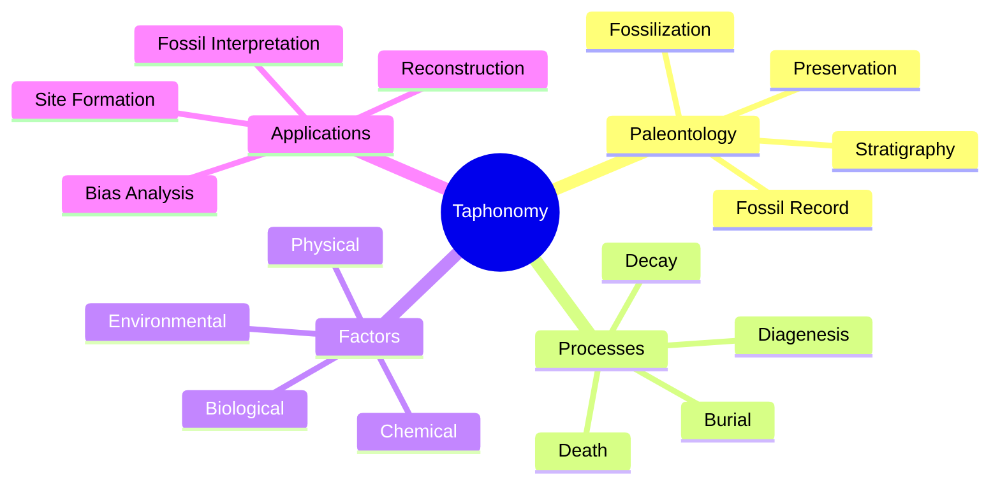

```mermaid
mindmap
  root((Taphonomy))
    Paleontology
      Fossilization
      Fossil Record
      Preservation
      Stratigraphy
    Processes
      Death
      Decay
      Burial
      Diagenesis
    Factors
      Biological
      Physical
      Chemical
      Environmental
    Applications
      Fossil Interpretation
      Site Formation
      Reconstruction
      Bias Analysis
```

