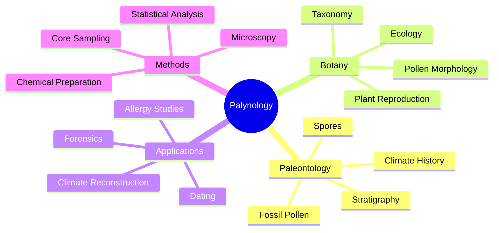

```mermaid
mindmap
  root((Palynology))
    Paleontology
      Fossil Pollen
      Spores
      Climate History
      Stratigraphy
    Botany
      Plant Reproduction
      Pollen Morphology
      Taxonomy
      Ecology
    Applications
      Climate Reconstruction
      Dating
      Forensics
      Allergy Studies
    Methods
      Microscopy
      Chemical Preparation
      Statistical Analysis
      Core Sampling
```

