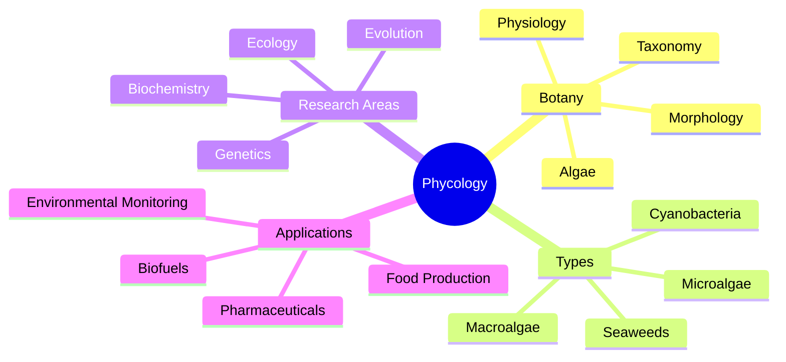

```mermaid
mindmap
  root((Phycology))
    Botany
      Algae
      Taxonomy
      Morphology
      Physiology
    Types
      Microalgae
      Macroalgae
      Seaweeds
      Cyanobacteria
    Research Areas
      Ecology
      Evolution
      Biochemistry
      Genetics
    Applications
      Biofuels
      Food Production
      Pharmaceuticals
      Environmental Monitoring
```

