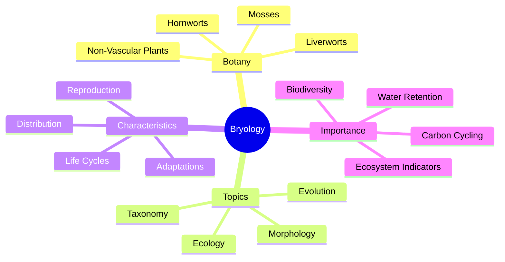

```mermaid
mindmap
  root((Bryology))
    Botany
      Mosses
      Liverworts
      Hornworts
      Non-Vascular Plants
    Topics
      Taxonomy
      Morphology
      Ecology
      Evolution
    Characteristics
      Life Cycles
      Reproduction
      Adaptations
      Distribution
    Importance
      Ecosystem Indicators
      Carbon Cycling
      Water Retention
      Biodiversity
```

