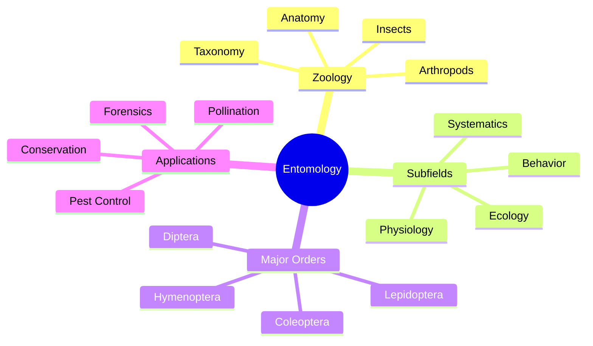

```mermaid
mindmap
  root((Entomology))
    Zoology
      Insects
      Arthropods
      Taxonomy
      Anatomy
    Subfields
      Systematics
      Ecology
      Behavior
      Physiology
    Major Orders
      Coleoptera
      Lepidoptera
      Hymenoptera
      Diptera
    Applications
      Pest Control
      Pollination
      Forensics
      Conservation
```

