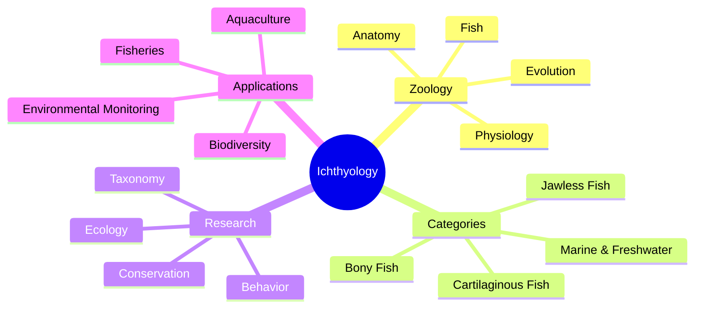

```mermaid
mindmap
  root((Ichthyology))
    Zoology
      Fish
      Anatomy
      Physiology
      Evolution
    Categories
      Bony Fish
      Cartilaginous Fish
      Jawless Fish
      Marine & Freshwater
    Research
      Taxonomy
      Behavior
      Ecology
      Conservation
    Applications
      Fisheries
      Aquaculture
      Biodiversity
      Environmental Monitoring
```

