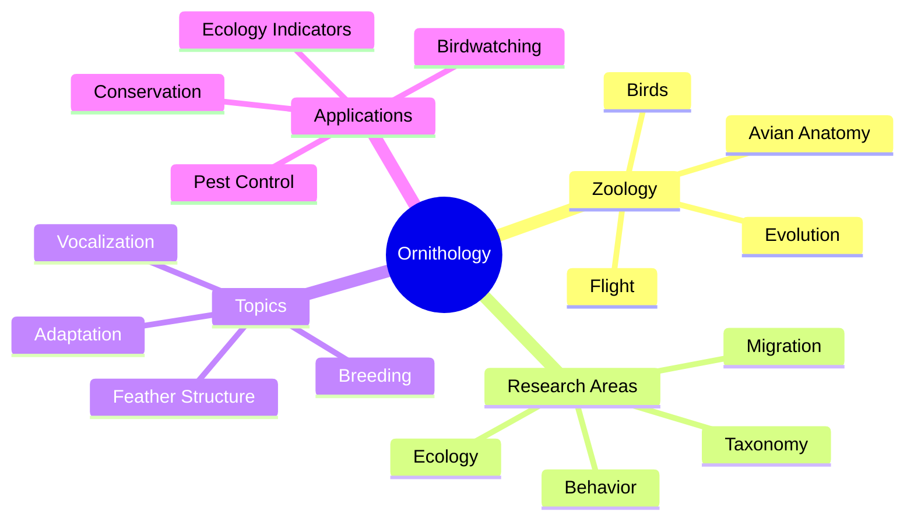

```mermaid
mindmap
  root((Ornithology))
    Zoology
      Birds
      Avian Anatomy
      Flight
      Evolution
    Research Areas
      Taxonomy
      Behavior
      Migration
      Ecology
    Topics
      Vocalization
      Breeding
      Feather Structure
      Adaptation
    Applications
      Conservation
      Ecology Indicators
      Pest Control
      Birdwatching
```

