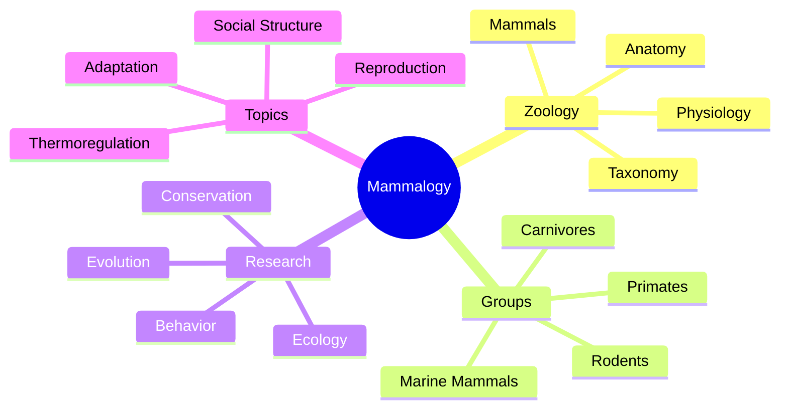

```mermaid
mindmap
  root((Mammalogy))
    Zoology
      Mammals
      Anatomy
      Physiology
      Taxonomy
    Groups
      Primates
      Carnivores
      Rodents
      Marine Mammals
    Research
      Behavior
      Ecology
      Evolution
      Conservation
    Topics
      Reproduction
      Thermoregulation
      Social Structure
      Adaptation
```

