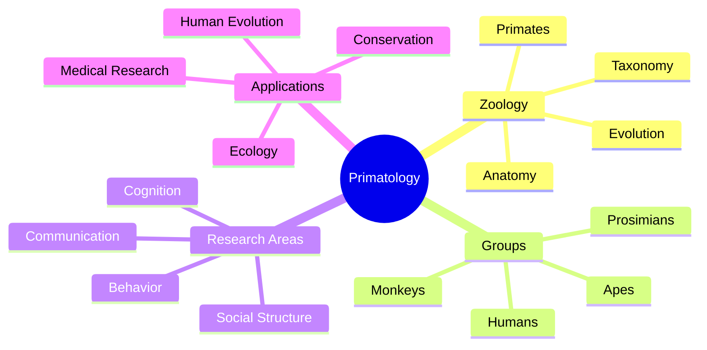

```mermaid
mindmap
  root((Primatology))
    Zoology
      Primates
      Taxonomy
      Anatomy
      Evolution
    Groups
      Prosimians
      Monkeys
      Apes
      Humans
    Research Areas
      Behavior
      Cognition
      Social Structure
      Communication
    Applications
      Conservation
      Human Evolution
      Medical Research
      Ecology
```

