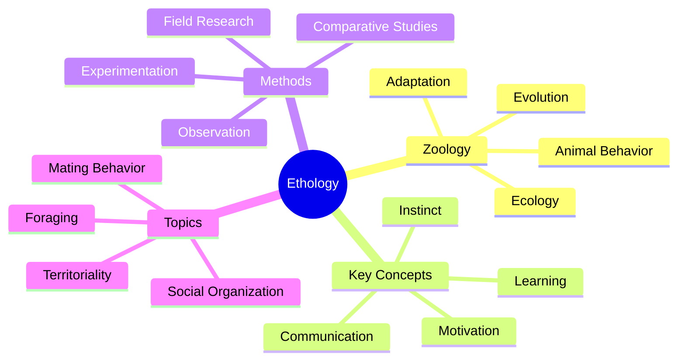

```mermaid
mindmap
  root((Ethology))
    Zoology
      Animal Behavior
      Evolution
      Ecology
      Adaptation
    Key Concepts
      Instinct
      Learning
      Motivation
      Communication
    Methods
      Observation
      Experimentation
      Comparative Studies
      Field Research
    Topics
      Mating Behavior
      Foraging
      Social Organization
      Territoriality
```

