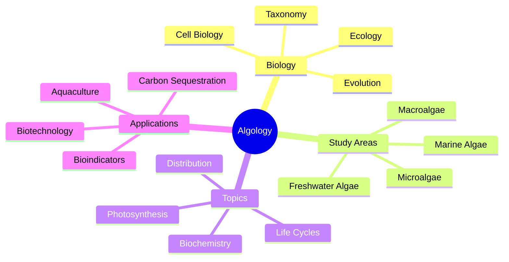

```mermaid
mindmap
  root((Algology))
    Biology
      Cell Biology
      Ecology
      Evolution
      Taxonomy
    Study Areas
      Macroalgae
      Microalgae
      Marine Algae
      Freshwater Algae
    Topics
      Photosynthesis
      Life Cycles
      Distribution
      Biochemistry
    Applications
      Aquaculture
      Biotechnology
      Bioindicators
      Carbon Sequestration
```

