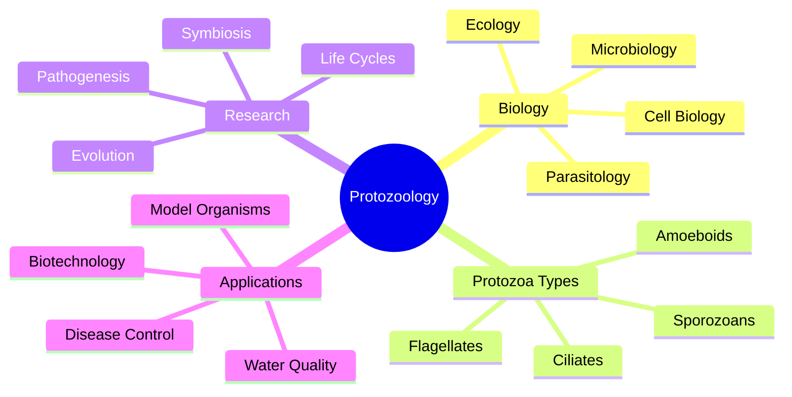

```mermaid
mindmap
  root((Protozoology))
    Biology
      Microbiology
      Cell Biology
      Parasitology
      Ecology
    Protozoa Types
      Flagellates
      Ciliates
      Amoeboids
      Sporozoans
    Research
      Life Cycles
      Pathogenesis
      Symbiosis
      Evolution
    Applications
      Disease Control
      Water Quality
      Biotechnology
      Model Organisms
```

