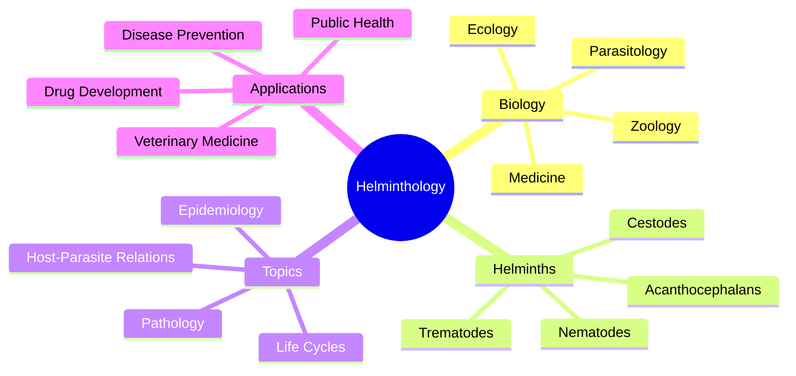

```mermaid
mindmap
  root((Helminthology))
    Biology
      Parasitology
      Zoology
      Medicine
      Ecology
    Helminths
      Nematodes
      Cestodes
      Trematodes
      Acanthocephalans
    Topics
      Life Cycles
      Host-Parasite Relations
      Pathology
      Epidemiology
    Applications
      Disease Prevention
      Veterinary Medicine
      Public Health
      Drug Development
```

